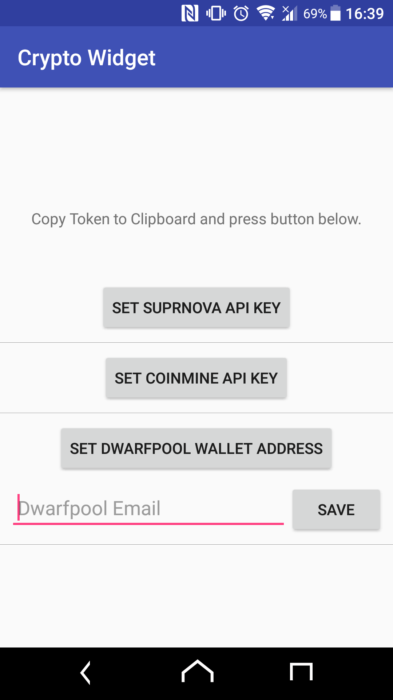
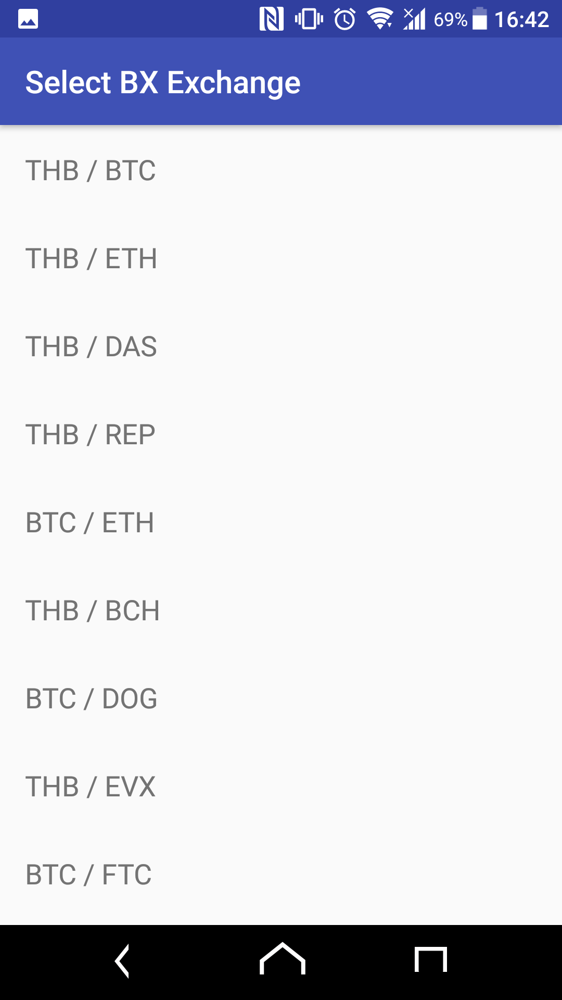

## Generic Mining Pool Monitor Widget

**Generic Mining Pool Monitor Widget** or **Crypto Widget** is an Android application for monitoring hashrate and balance on your pools. It currently support Suprnova, Coinmine and Dwarfpool. All you need to do is start the app and insert your pool's API key and DONE!

## BX Widget

**BX Widget** is one of Crypto Widget feature allow you to add BX.in.th (Probably the biggest exchange in Thailand.) cryptop exchange rate to your Android device home screen so you can see your coins of interest.

